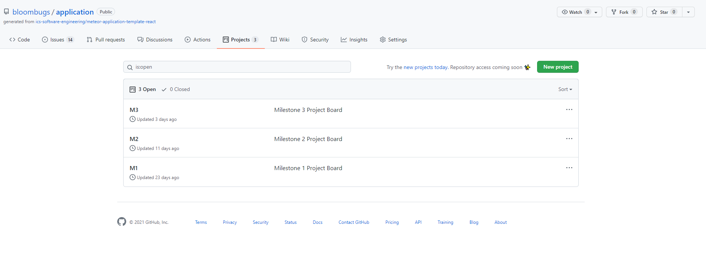
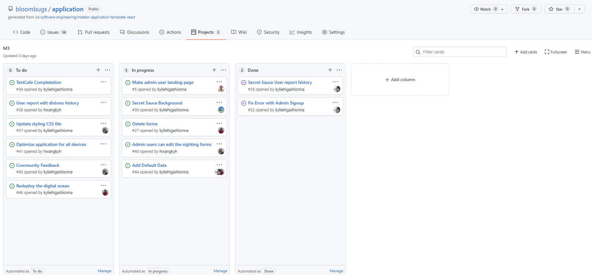
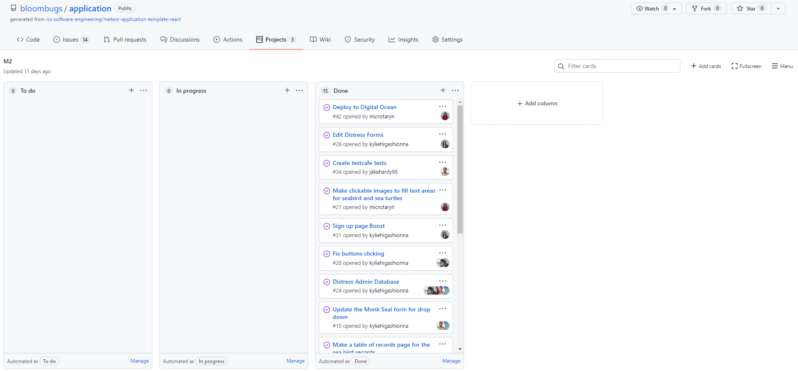

I learned many important and helpful skills about web application development and its uses beyond this field from ICS 314 at the University of Hawaii at Manoa. Before taking this course, I knew little to nothing about how to create a web application or the different fundamental concepts that it requires. We started off by first reviewing JavaScript since many of the applications we would create would involve understanding this language. The next step was to learn about HTML and CSS and its function in creating a website. This was the very first time that I had to use HTML and CSS which made it a bit confusing and difficult to adapt to. I learned about the different tags such as the h1, h2, and p tags that are used in HTML to structure the page, as well as linking a CSS file to the HTML file in order to style and format the page, such as the color, font, and background color. Through now knowing about HTML and CSS, we were able to build on this by learning about UI frameworks. UI frameworks are a group of interfaces, classes, and JavaScript functions that simplify the making of the web page design for the user. We used the Semantic UI framework which helped in creating a nicer looking webpage through using its pre-made HTML code for structuring certain parts of the page. Later on, we used the React version of Semantic UI, learned about the Meteor framework, and developed basic databases with MongoDB. Step by step, we were able to learn all of the pieces we needed in order to create a web application and could finally put them together. In the last portion of this course, we focused on creating our own application within a group which showed me the importance of two fundamental concepts in particular. They were the Agile Project Management, and coding standards concepts. 

## **An Organized Group is a Unified Group**

Agile Project Management is an iterative project management method to let the team continuously improve their product through taking revisions and changes into consideration. The type of Agile Project Management we focused on using was known as Issue Driven Project Management. The Issue Driven Project Management helped a team to work more efficiently though breaking a project into different milestones which contains small tasks and issues that get assigned to different members of the group. This method of project management helped my team in keeping organized on the different tasks that need to be completed and who would be the member in charge of completing them. This also helped all the members continue to be on the same page for the type of things that everyone wanted to implement and add. It also included a guideline of when to gather as a group to discuss changes and improvements that should be made, which gave us an incentive to schedule a time and date for everyone to meet. Even though we used this method for creating a web application, this method can be used and applied to many other different types of tasks as well. This can be applied to a group project for creating a presentation, research papers, making some kind of product, etc. Each of these would benefit from using the IDPM method since everyone can easily divide the tasks while knowing what others are working on. For example, in the context of creating a research paper, the different topics that need to be researched can be divided up and assigned to the different members, and they can make a schedule for goals or milestones that should be achieved by a certain time. 
___________________________________________________________________________________________________________________________________________________________________________________

___________________________________________________________________________________________________________________________________________________________________________________
## **Clear Communication**

Coding standards are a set of guidelines for different programming languages. They usually standardize the indentation, number of white spaces, naming convention of variables and methods, etc. These standards help and improve readability as well as detecting errors. When working in a group, having these standards for coding helps everyone in the group be able to understand the code that others wrote, as well as one’s own code when looking back on the project. These coding standards can also be used for other projects than just web applications such as creating algorithms, machine learning, making a program to do a certain function, etc. These types of projects usually have a lot of people working in a group over a long period of time where many times a person may work on a project and write code for a company, but they may leave the company in which a different person must work on the code. In times like these it is important to use the coding standards to make it easier for another person to look at and understand the code, in the case that the one who wrote it is not there to explain it.