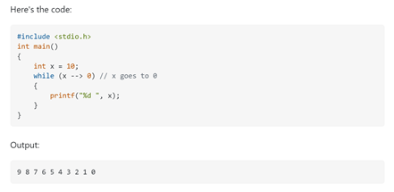

## **Searching the Web**

When searching for answers, I always first try to use google as my means of finding the solution. Many times, I am looking for help on math, programming, and hardware issues for the computer. Some of the common sites that come up from the results of the search are Reddit, Stack Overflow, and other web forums. I would see similar questions to mine being asked in these forums, however some would either be unanswered or have a rushed and unclear answer. I also noticed that most of the answers that have helped me were from Stack Overflow rather than Reddit. This might be from the fact that Reddit is not the right/best forum to be asking math or programming type of questions on. This has led me to notice that there is an art in formulating a smart question and choosing the best forum to bring the odds of the question getting answered up.

## **The Not so Smart Way**

Some guidelines on avoiding to create the not so smart types of questions would be to first thoroughly check that the question is not already asked on other forums and sites. Then you would need to find the best forum/site to post this question to, and verify it is the correct topic with the level of questions being similar. When posting the question, it is best to keep away from using vague and anguished descriptions as the subject header and have the correct tags. Though many of these points may seem obvious, posts that have these problems still occur.

### **Unclear Questions**

One question that violates these principles has its subject header as [“I can’t take input from user properly”](https://stackoverflow.com/questions/58670344/i-cant-take-input-form-user-properly). This is a very vague title since it does not specify the coding language it is referring to. The only tag it had was C which was the language it was written in; however, it could have also included user-interface since it deals with human interaction. The description of the question stated “I can’t take inputs as I want. gets() doesn’t work properly. If I put n=3, it always get total 5 input as a string. why not 6?”, with a picture of the written code. Within the description itself, it had many grammar mistakes as well as what seems as a lack of effort from taking the time to formulate the question well, or write things they did to try to fix the problem. There were no answers for this question, however there were comments.

### **Unclear Answers**

Many of the comments that were given mirrored the quality of the written question in terms of clarity and efficiency. The first comment stated “Neven ever use gets. Google “why is gets dangerous” to find out why”. This comment tells the asker to google the gets() function rather than explicitly explaining it to them. Just as how the question was rushed, the answer also did not give a lot of details or description. Another commenter had posted “What do you mean by “it always get total 5?”, ““why not 6?” Why 6?”.  This comment had many questions about the ending result which reflected back on the lack of clear description of the problem and the goal the asker was trying to achieve. Many of the commenters had to ask about the input the asker was using which made it difficult for both parties since the asker would need to reply promptly, and the commenter would need to wait for the reply. In the end, the asker’s problem never got resolved or had a good explanation on the issues.
 
## **The Smart Way**

Some guidelines on making smart questions would be similar to what one should avoid in making a not so smart question. Be sure to find the best forum and have a thoroughly thought-out question. The question should be precise through describing the environment the problem occurred in, research one already did on the issue, the goal of the asker, and the steps that have been taken before asking the question.

### **Smart Questions**

One question that fulfills these precepts has its subject header as [“What is the “-->” operator in C/C++?”](https://stackoverflow.com/questions/1642028/what-is-the-operator-in-c-c?answertab=votes#tab-top). This title is very clear in that it states the programming language they are dealing with, being C/C++, as well as a specific question on what “-->” is. The tags used in this post were C++, C, Operators, Code-formatting, and Standards-compliance. It was smart from tagging the programming languages, as well as operators since the asker thought the “-->” was an operator. It also used the code-formatting and standards-compliance tags since “-->” could also be a legibility of source code issue. The description of the question states “After reading Hidden Features and Dark Corners of C++/STL on comp.lang.c++.moderated, I was completely surprised that the following snippet compiled and worked in both Visual Studio 2008 and G++ 4.4. I'd assume this is C, since it works in GCC as well. Where is this defined in the standard, and where has it come from?”, with the source code. This description had many good points stating where the source code came from, what environment and compiler was used, things they did to test the code, and a clear intent of what they wanted to know. There were many answers for this question.

   

### **Smart Answers**

The top answer stated “--> is not an operator. It is in fact two separate operators, -- and >. The conditional's code decrements x, while returning x's original (not decremented) value, and then compares the original value with 0 using the > operator. To better understand, the statement could be written as follows: while((x--) > 0)”. This answer is very clear and concise which again reflects on how the question was also well-defined. It has a clear step by step explanation on how the value of x is changed. The answerer wrote the code out in a different way to be more legible for the asker to understand. This question was resolved with many upvotes not only on the answer, but also on the question which showed that many people were helped though it.

## **Insights on Asking Smart Questions**

Smart questions are important for smart software engineers. Through asking smart questions, smart software engineers can ask other professionals about questions that stump them, to become even more knowledgeable. Smart questions don’t waste the time of the answerer from figuring out the details of the question and can also entice smart software engineers to answer them, to receive a wise answer. Wise answers then are beneficial and helpful to everyone that has the same issue. Through looking at the difference between smart questions and not so smart questions, I learned the importance of formulating a well thought out question. I will keep in mind to clearly state the environment and compiler used, research done, goal of the question, and the steps that have already been taken when posting a question. 
