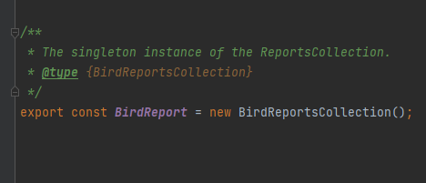
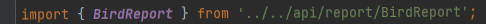
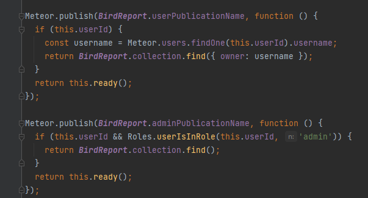
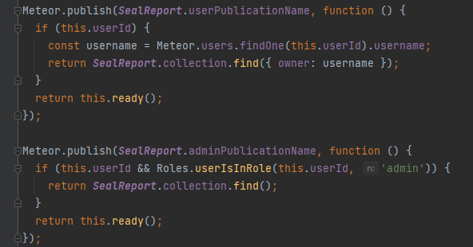
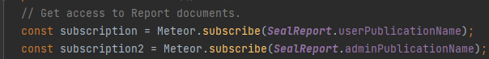
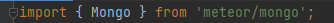
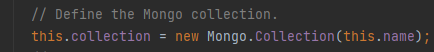
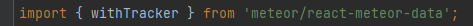
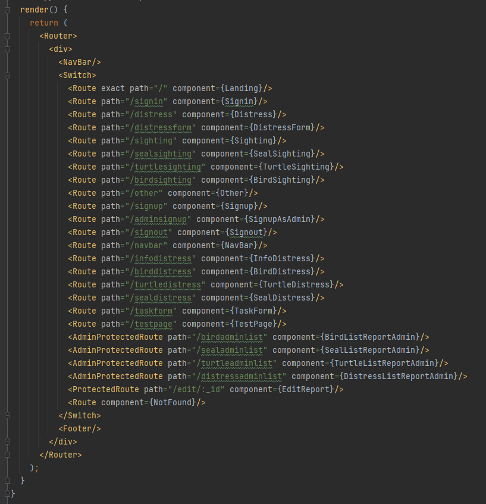

Throughout history many mathematicians have created different math formulas which have been changed, debated about, and improved by the next generation. Many of these math formulas that were created were used as a model to solve certain types of problems. Some examples of these are the Pythagorean theorem, binomial theorem, differential calculus formulas, etc. Though similar problems may yield a unique answer, they use the same mathematical formula to be solved, which is very similar to design patterns. Design patterns have been implemented in many different fields such as architecture, engineering, and even cooking. In general, they take one general solution as a template which can be used and reproduced to solve multiple similar problems. For example, with cooking there may be an overall recipe on how to create cookies, but that recipe can be tweaked and changed to allow for variety such as creating chocolate chip cookies vs. oatmeal raisin cookies. I would like to focus on the use of design patterns in software engineering in particular. Some notable design patterns that are often used are known as Singleton, Observer, and Model-View-Controller. 

## **Globally Accessible**

The Singleton design pattern makes it such that a class only has one instance and allows it to be globally accessible. It can let a coding language that does not usually support global variables be able to have this global state. This pattern is very easy to implement within one’s code, however can be considered unsafe or unwise since having global variables is not always the optimal choice. This is similar to an English classroom that may have a single dictionary and the students within this classroom need to share this one dictionary. This dictionary is global since everyone in the classroom can use it, while a student’s notebook would be considered local because it is only allowed to be used by the student who owns it. In the photos below it shows that we created a new instance of an object that was named BirdReport which we exported. The BirdReportsCollection can be manipulated through importing the variable known as BirdReport within another file. Through using the variable name, we can invoke different methods on it such as the userPublicationName or the collection.find method. 

### **[Singleton Example Code:](https://github.com/bloombugs/application)**
___________________________________________________________________________________________________________________________________________________________________________________

___________________________________________________________________________________________________________________________________________________________________________________
## **Event Handlers**

The Observer design pattern lets an object that is known as the subject has many dependencies with other objects which are called the observer. The subject objects notify the observer objects when there is a change of state with that object. Some of the changes can be a result of a method being called, or when certain events occur. There are many advantages to using this pattern such as dependencies being able to be changed at runtime, however, this implementation can be complex to debug if there are any problems. This is similar to when a person gets a new email sent to them. The subject object in this case is the email app and the observer object is the person it got sent to. This is because it notifies the person there is a new email by having a red circle in the upper right-hand corner with the number of unread emails. The design pattern known as Publish-Subscribe would fall under this umbrella category of the Observer pattern. The publishers determine the way certain information is available and relays it to certain subscribers that it is associated with. This is similar to users who subscribe to a Youtuber. When the Youtuber releases a new video it notifies the user, but it only notifies the users that are subscribed to the Youtuber and nobody else. In the photos below it shows that there is a method called publish which makes a meteor publication which when subscribed to it will give the contents of the BirdReport collection which will differ a bit for a normal user and an admin user. 

### **[Observer Example Code:](https://github.com/bloombugs/application)**
___________________________________________________________________________________________________________________________________________________________________________________

___________________________________________________________________________________________________________________________________________________________________________________
## **Separate and Organized Arrangement**

The Model-View-Controller design pattern separates the model from the view and uses the controller as the mediator between these two. This is a very efficient pattern to use since when working on a big project, the programmers that specialize on the database can work on the model, and the coders that specialize in the user-interface side can work on the view without either of them getting in each other’s way. This arrangement of files can also make it easier for teams to be on the same page and work well together. This is similar to a bakery with the bakers working in the back, the cashiers managing the counter, and the customers are in the front. The bakers and the customers are completely separate and never meet or see each other, however the cashier deals with bringing the finished baked goods to the front while dealing with the customers. In this way the cashiers act as the controller, the bakers manage the database, and the customers represent the view. The photos below show the model which uses MongoDB as its database, the view which uses React, and React Router as the controller to connect them together. 

### **[MVC Example Code:](https://github.com/bloombugs/application)**
___________________________________________________________________________________________________________________________________________________________________________________

___________________________________________________________________________________________________________________________________________________________________________________

