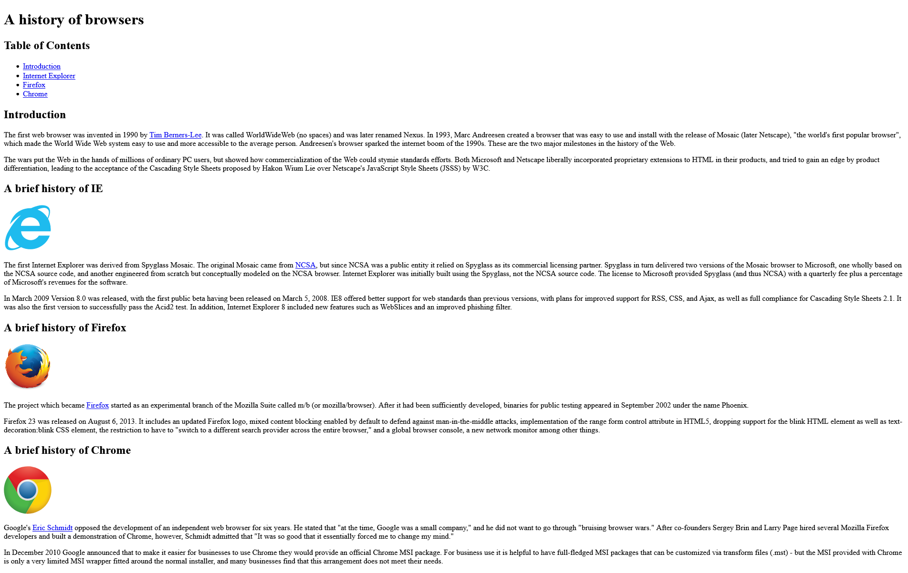
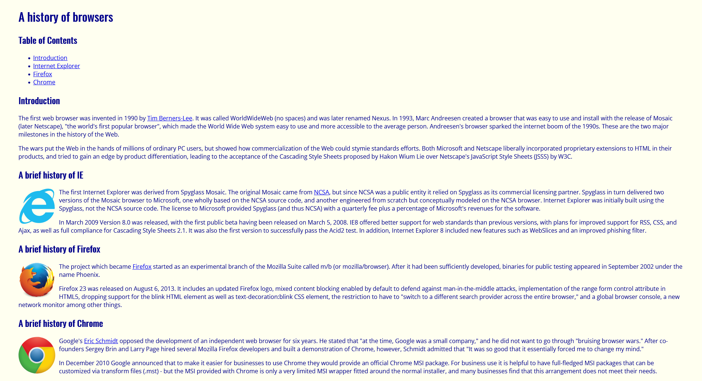
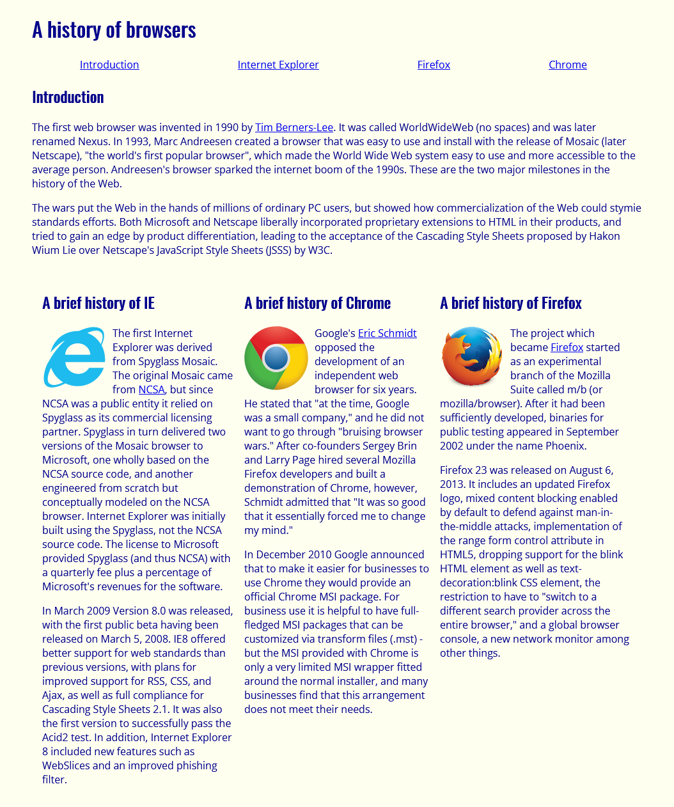

When I was a junior in college, I learned how to create a website through using HTML and CSS for the first time. Both HTML and CSS were very different from anything I have learned before. I began with creating a basic webpage though only using HTML starting off with the h1, h2, and p tags for the text. Then I used the a tag for the links, and the img tag putting all the images in their respective places. Once I got all the relevant information to appear on the page, I created a CSS file and linked it to the HTML file. Within the CSS file I played with the background color, font color, font family, and the position of the images. Through only using basic HTML and CSS, I was able to make a webpage, though it looked very elementary and plain. The layout and overall impression of the webpage was boring since it lacked an eye-catching design. However, with my limited knowledge in HTML and CSS, creating a nice layout such as having a dropdown menu or grid would be very complicated and intricate. This is when I started to learn more about UI frameworks. UI frameworks give a set of interfaces, CSS classes, and sometimes JavaScript functions which can simplify the development of the design, give an appealing look and feel, and produce consistent results across different browsers. There are many different kinds of UI frameworks such as Bootstrap, UIkit, and Semantic UI.

## **The Worth of Learning Semantic UI**

Though UI frameworks are not simple and learning them can be as complicated as learning a new programming language, there are still many benefits in using them. One framework that is relatively beginner friendly is Semantic UI. Semantic UI is a UI framework which helps to create responsive and beautiful designs. One nice aspect of this framework is that the syntax used for classes stems from the natural language where the word order and plurality match the English syntax. This makes it not only more readable, but also easier to comprehend what the class is doing. Though one might get frustrated and would need to invest a lot of time in learning Semantic UI to become proficient in it, the outcome of learning Semantic UI ends up saving a lot of time. It saves a lot of time because it provides HTML code that you don’t need to create from scratch. Using Semantic UI is more efficient, and easier to manage bigger projects than just writing in raw HTML and CSS. Only using raw HTML and CSS can get messy and repetitive if it is not organized well. This can also make it harder to debug the HTML since it would not be as readable and neat. However, it would be a good idea to get comfortable in creating a nice webpage though just HTML and CSS and building off this knowledge with using a framework, rather than jumping to using a framework from the beginning.
 
## **Going Forward with Semantic UI**

Though there are some cons to using Semantic UI such as less customization, and sites made with the same framework might look similar, overall, I enjoyed using this framework. It helped me to learn more about CSS and create web pages I never thought I would be able to make before. It also helped with the webpage being more organized in a grid like fashion, therefore making it more cohesive and balanced. Going forward I will continue to learn more about Semantic UI and hope to get better at creating a beautiful webpage. I also am interested in learning about other frameworks such as Bootstrap. 
