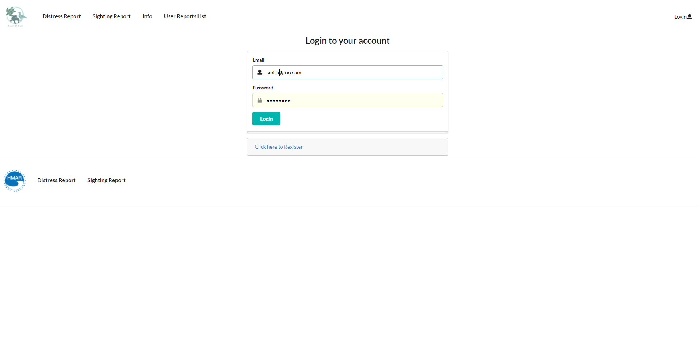
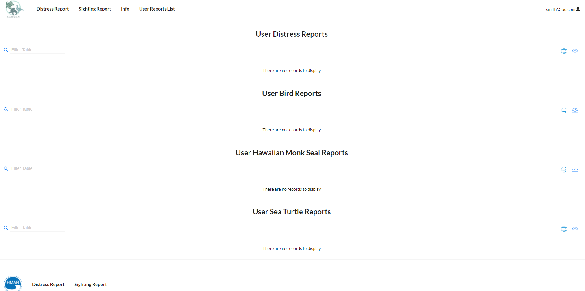
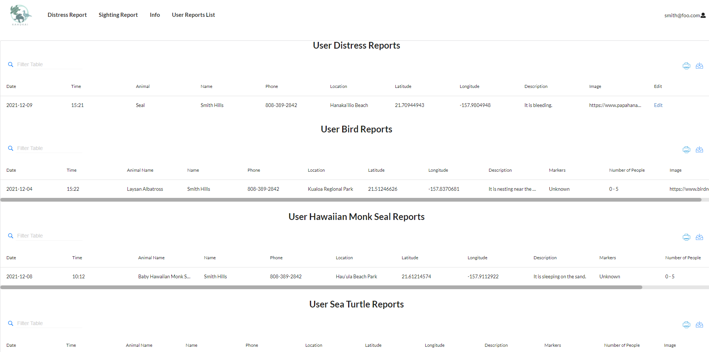
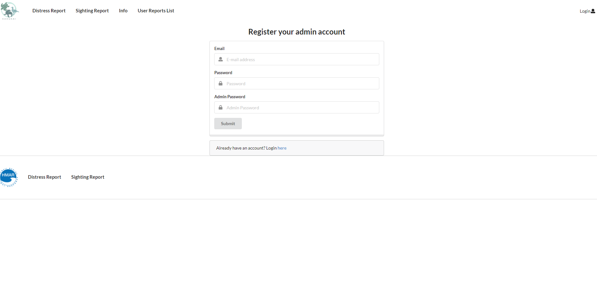

## **Hawaii Annual Code Challenge**

The Hawaii Annual Code Challenge is a hackathon that encourages community engagement with local businesses and technology companies. This hackathon takes place over multiple weeks for the teams to communicate and interact with the state department personnel in order to build a relationship. There are different challenges that teams can code solutions for that actually help local organizations and communities. For the 2021 Hawaii Annual Code Challenge my team decided to choose the challenge proposed by NIC Hawaii, the Hawaii Marine Animal Response (HMAR) Sighting & Reporting App. Currently HMAR handles all animal sighting reports by phone. HMAR and NIC mentioned that they would like to have the ability to handle reports via an application as well - to decrease the amount of phone traffic and confusion as well as make it easier to record each sighting.

## **Project Specifics**

Our group created a web browser application that is accessible on both the mobile and the computer. We created different landing pages for the public users who are reporting animal sightings on the go and for the admin users accounts who are the HMAR staff that are managing the sighting reports database. There is a login and sign-up page for the admin users to access these additional capabilities as well as for public users. The public users are not required to login or sign-up to submit forms. However, through creating an account each user will have access to a tab called User Reports List where the user will be able to see their history of reports submitted. The public users will see a landing page with a link to the animal in distress form, animal sighting form, and a more information page. The admin users will see a landing page similar to the public user landing page, but will have multiple tabs in the navbar that link to a list of reports for the different animal sightings and distress reports. When a report is submitted by either the admin or public user, it will be added to the list of records that the admin users view. We are using Meteor etc. to create the application and Mongo is used to store the animal sightings. Using Meteor will allow the application to be supported on a web browser and mobile devices. The application is hosted on a DigitalOcean droplet.

## **My Contributions**

Throughout this project I learned more about using meteor and creating different forms and tables that link to the database. Some contributions that I wanted to highlight was the web page that contains the information about the user’s report history. For this web page I first needed it to display the different tables for the monk seal sighting, turtle sighting, sea bird sighting, and distress reports. I then had to feed the tables only the information of reports that were submitted by the present logged in user. This task involved giving access to certain report documents to public users by using publish and subscribe methods, as well as making sure the owner of each submission is linked to their email username. I also made the admin sign up page which involved creating another field for an admin password and connected the server method for creating an account to the client side. I set the admin password within the .json file which I use on the client side to confirm the admin user inputted the correct password. To create a new admin account, I needed to make a meteor method within the server-side Accounts file and call this method on the client side SignupAsAdmin file. 

___________________________________________________________________________________________________________________________________________________________________________________
### **[User Report History](https://github.com/bloombugs/application/tree/issue-35)**

The user will be shown the login page to access the User Report List page.

___________________________________________________________________________________________________________________________________________________________________________________

If the user has yet to submit any forms, their tables will show no entries. 

___________________________________________________________________________________________________________________________________________________________________________________

When the user has made multiple submissions, they will be able to see all their past reports on the different tables. 

___________________________________________________________________________________________________________________________________________________________________________________
### **[Admin Signup Page](https://github.com/bloombugs/application/tree/issue-32)**

___________________________________________________________________________________________________________________________________________________________________________________
## **Learning from this Experience**

This project was very beneficial to my understanding of the connection between the server side and the client side within meteor. I learned more about publication and subscription for users, connecting the database to the tables, creating accounts on the client side through server methods, and creating default accounts and data within the .json file. Through this app I will always be able to look back on the way I created tables, sign up/log in pages, simple web pages with a navbar, different pages for certain users, etc., as a template for future endeavors. I also got more comfortable working in a group setting and managing the tasks between the other members, as well as communicating ideas and improvements with others. 

You can find the link to this project's github [here](https://github.com/bloombugs/application).