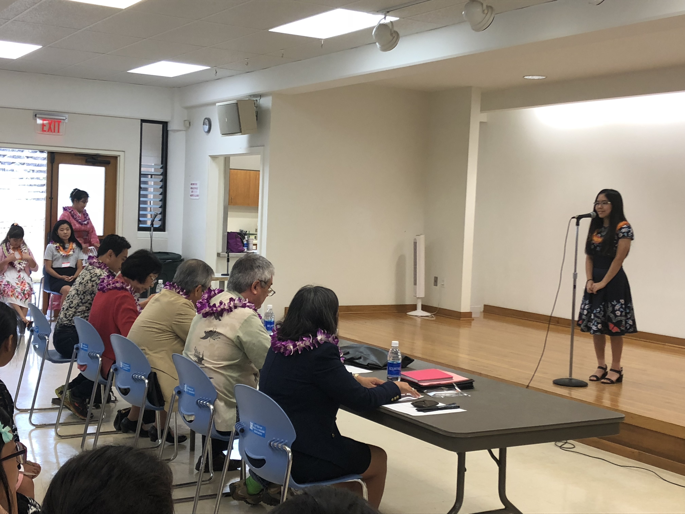

## **Japanese Language Achievement Award Ceremony**

When I was a junior in high school, I took part in the Japanese language achievement award ceremony. This event was put together by the United Japanese Society of Hawaii who promotes and encourages the study of Japanese language and culture in Hawaii. This event was to recognize students who excel in the Japanese language from different schools all around the island. All the students were to prepare a three-minute speech in Japanese related to the 150th Anniversary of the Gannenmono (the first official group of Japanese immigrants).

## **My Speech**

I wrote my speech about my ties to Japan and about my ancestors that decided to go to a new country being USA, Hawaii in search of a better life not only for themselves, but also for their family. I first wrote the speech in English and then slowly translated it into Japanese with the help of my Japanese teacher at the time. After fully translating it into Japanese I started to memorize each line one at a time. It took some time before I was able to fully recite the speech, but every now and then I would get tripped up on what would come next. However, all I could do was continuously practice until it was second nature. The next step was to put emotion into what I was saying to really convey the message to others. I remembered that I would practice in front of my teacher, parents, and grandfather and look for advice as to how to improve my delivery. 

## **Giving My Speech**

On the actual day I was very nervous to present my speech in front of everyone. However, since I practiced so much, I was also a bit excited to tell everyone my story. Through all my hardword and perseverance, I was able to say my speech in front of everyone while not making any mistakes and just trying to be in the moment. Through this experience I got better at public speaking as well as communication to be able to express my story. I also gained more confidence in myself through this since I accomplished such a hard task and exceeded my expectations.  

You can learn more about the [Gannenmono](https://kizunahawaii.com/).
