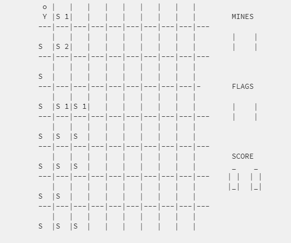

## **Programming in C**

In my freshman year at the University of Hawaii at Manoa I took EE160 which had a final project called Timmy Finds the Exit. This project was supposed to be very similar to the minesweepers game where it’s a single player game and the goal is to move “Timmy” safely through the minefield to find a secret exit that is not visible. We had an 8 by 10 cell area minefield, in which the player earns points if they move Timmy to a safe position and even more if they find the exit. However, if Timmy’s position is moved to be on a mine, then the player dies, and the game will be reset if the player wants to continue. Some of the features our game needed to fulfill was to have a menu, different levels of difficulty, movement, detector, flag planting, win condition, and movement and flag planting off the edge not being allowed.
 
## **Working as a Group**

I was the leader of our three-person group. Since I was the leader, I had the most responsibilities for the project. I created the movement function, detector function, flag planting function, win condition, and made sure that movement and flag planting could not be done off the edge of the map. The other two teammates worked on the menu and the different levels of difficulty. I found it was easier to make all these functions myself since there is a lot of overlapping and interaction between all these commands. I found that flag planting function affected the movement, and that the movement affected the detection. If each person were to make a different function it would have been harder since we would have had to make sure if our code was compatible with each other since it affects other functions.
 
## **Takeaways from the Project**

Through this project I learned a lot about C programming. I learned more about creating functions and setting conditionals. It was interesting to see how the result of a certain function can also affect the result of another function. I also realized the importance of commenting on one's code especially since working in a group requires a lot of communication. From experiencing this project, I learned how to better cooperate with others when working on a coding project, as well as being a good leader by checking in on my teammates and creating a schedule. 

This was the display of the minefield area.
